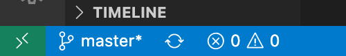
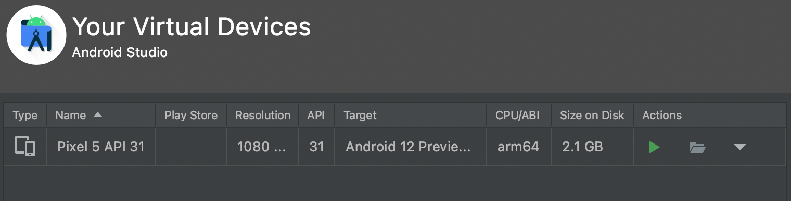

# **Running this app**

To install all dependencies needed run (in the root folder; `{username}/wos` (mac), `C:\users\\{username}\wos` (Windows))
```
npm install
```

## **Running on an Android Phone**

### **Prerequisites**
- You must have Android Studio installed
- You must have [ADB](https://developer.android.com/studio?gclid=CjwKCAjwxo6IBhBKEiwAXSYBsyKyrY4NLHnkpQamIU8c0KMLJvqIsf0uYf5iceMLlAds0cbjKh1c0xoCX4MQAvD_BwE&gclsrc=aw.ds) installed

On your device:
- Go to Settings -> About Phone -> Software Information and tap Build Number 7 times
- Go to Settings -> Developer Options, scroll down to and tick "USB debugging"

Connect phone to computer and allow any connections.

In VS Code, Open the Terminal (Press the warning triangle then press terminal) 




Run this to start a server:
```
npx react-native start
```

Create a new terminal (the + near the bin symbol) and run this to start the app on your phone:
```
npx react-native run-android
```

## **Running on an Android Emulator**

You'll need to create an emulation device. 
- Open Android Studio.
- Press the three dots (top right hand) or 'Configure' (bottom right)
- Click 'AVD Manager'
- Click 'Create Virtual Device'
- I'd recommend using Pixel 4/4a/5, this way everything will scale up nicely to the XL screens
- Follow the instructions (Use Android S if you can, try to keep it as recent as possible)
- Once done, press the green play button in the AVD Manager


Follow the VSCode steps in the above section.
<br/>
<br/>
Let me know if you have any issues :)